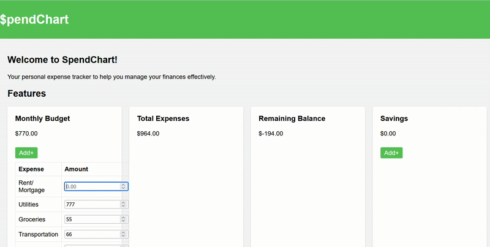

# SpendChart

SpendChart is a small, friendly web app that helps you understand and manage your personal spending. It provides a clean dashboard to track expenses, visualize spending by category, and set simple savings goals — all from a lightweight static site that runs in your browser.

**Key ideas:** quick insights, low friction tracking, and clear visuals so you can make better spending decisions.

## Demo



- Open `index.html` in your browser to view the app locally, or run a local HTTP server (instructions below).
- Add screenshots to the `docs/` folder and link them here for a nicer README.

## Features

- Track expenses with amount, category.
- Set and monitor savings goals.
- Lightweight frontend-first implementation

**Tech stack**

- Frontend: HTML, CSS, and JavaScript (single-page/static site).
- Optional: Python for local dev/test utilities (see `requirements.txt` and `test_file.py`).

**Prerequisites**

- Python 3.8+ (optional — only needed if you want to run a local HTTP server or run tests).

## Quick start (view locally)

1. Open the app directly:

```text
Open `index.html` in your browser (double-click or use your editor's Live Preview).
```

2. Run a simple local HTTP server (recommended) from the project root:

```powershell
python -m http.server 8000
# Then open http://localhost:8000 in your browser
```

## Install dependencies (optional, for running tests or Python helpers)

```powershell
python -m venv .venv
.\\.venv\\Scripts\\Activate.ps1
pip install -r requirements.txt
```

**Run tests**

If you have `pytest` in `requirements.txt`, run:

```powershell
pytest -q
```

**Development notes**

- The app is intentionally small and frontend-first. If you want to add persistence (save data between sessions), consider adding a lightweight backend (Flask, FastAPI) or using browser storage / IndexedDB.
- If you add build tooling (e.g., bundlers or preprocessors), include a `package.json` and update this README with build/run steps.

## Contributing

- Found a bug or want a feature? Open an issue or submit a pull request.
- Keep changes focused and include short descriptions and screenshots where appropriate.

## Ideas for improvements

- CSV import/export of transactions.
- Recurring transactions and notifications.
- User accounts and secure sync (requires a backend).

**Contact / Author**

If you want help improving this README or the app, open an issue or reach out to the repository owner.
